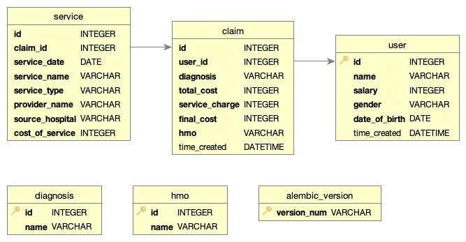
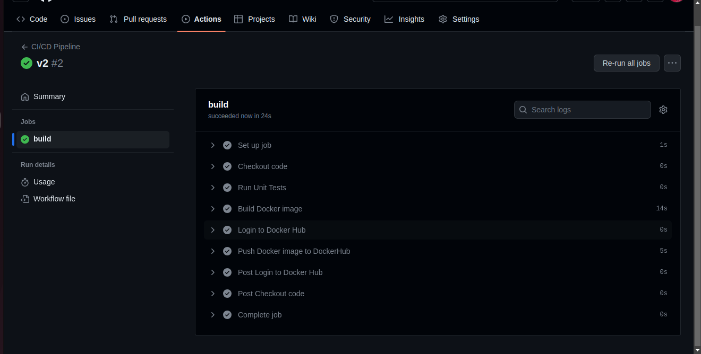

# intronhealth-claims Assessment

The application is deployed on AWS here:

The url of the API is http://16.171.5.210/home (please note that this is a HTTP url , not https)

The API was deployed on AWS using Docker and Docker Hub

## DataBase Schema

##### Database Diagram showing the relationships between Tables in the application

Here are some sample URLS to interact with the Application

## The Landing Page

I created A little landing page for the application and it can be accessed at:

http://16.171.5.210/home

## List of All Claims

http://16.171.5.210/home/all/claims

## CiCd - Continuous integration and deployment

##### For CI/CD , i used Github Actions .

Continous integration and deploymet was done using github actions . When a push or merge request is made to the main branch , the pipeline triggers and packages the new version of the code to dockerhub

Dockerhub was used as the container registry for this application.

The docker registry can be reached via the link below

https://hub.docker.com/repository/docker/oluwatofunmi/intron-health-service

### CiCd pipeline can be seen here:

https://github.com/21toffy/intronhealth-claims/actions

##### CICD Pipeline showing a successful build

## Gitops

The deploy.sh script you provided is a Bash script used for building a Docker image and pushing it to a Docker registry.

TODO (other things i would have done)
Write Addequate tests to Ensure Correctness of code
Setup Image updater with ArgoCD (for automatically pulling images)
Store docker images on ACR
Connect a domain for this
